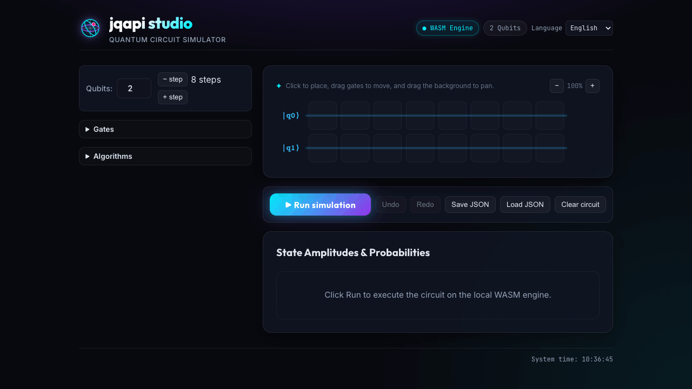

# Java Quantum API [](https://github.com/aitan75/jqapi/actions/workflows/build.yml) [](https://sonarcloud.io/summary/new_code?id=aitan75_jqapi)

_**jqapi**_ is a Java Api library to test quantum computing concepts. At the moment you can simulate your quantum circuit with a local simulator.

## Documentation

- **User Manual** — start here: [overview & first program](docs/manual/README.md), [core concepts](docs/manual/concepts.md), [worked examples](docs/manual/examples.md)
- **API Reference** — [index](docs/api/README.md): [quantum](docs/api/quantum.md), [gates](docs/api/gates.md), [simulator](docs/api/simulator.md), [math](docs/api/math.md), [visualization](docs/api/visualization.md)
- **Wiki** — [project wiki](https://github.com/aitan75/jqapi/wiki) for a guided overview, architecture notes, CI/quality explainer, and FAQ

***

## Installation

jqapi ships in layers — install only what your use case needs.

| Use case | What you install | Toolchain |
|----------|------------------|-----------|
| Embed the quantum simulator in a JVM application | the **library** (`org.aitan:jqapi`) | Java 25+, Maven 3.9+ |
| Run or develop the browser **circuit editor** | the **full product** (`jqapi-web`, with the WASM engine already bundled) | Node.js 20.19+ (or 22+), npm |
| Rebuild the WASM engine after changing the core | the **engine build** (`jqapi-wasm`) | JDK **21** (exactly), Node.js |

### 1. The library only (JVM projects)

The library is not yet published to a public Maven repository, so install it into
your local repository first:

```bash
git clone https://github.com/aitan75/jqapi.git
cd jqapi
mvn -DskipTests install     # installs org.aitan:jqapi:1.1.1 into ~/.m2
```

Then depend on it from your project:

```xml
<dependency>
    <groupId>org.aitan</groupId>
    <artifactId>jqapi</artifactId>
    <version>1.1.1</version>
</dependency>
```

See [Getting Started](#getting-started) for a first program.

### 2. The full product (browser circuit editor)

The editor lives in [`jqapi-web/`](jqapi-web/) and **bundles a pre-compiled copy of
the simulator** (the vendored `src/wasm/jqapi.js`), so running it needs only Node —
no JVM, no backend:

```bash
cd jqapi-web
npm ci --ignore-scripts
npm run dev       # dev server at http://localhost:5173
npm run build     # production bundle in jqapi-web/dist/ (static files)
```

The editor supports `H`, `X`, `Z`, and `CNOT` on 1–8 qubits, with results shown as
outcome probabilities. The full gate set is shipped with the library — see
[Supported gates](#supported-gates) below.

### Bell-state editor demo

The 20-second walkthrough creates a Bell state: on two qubits, drag `H` to
qubit 0 in the first column, add the `CNOT` control and target in the next
column, then run the circuit. The local WASM simulator shows equal probability
for `|00⟩` and `|11⟩`.



### 3. Rebuilding the WASM engine (only if you change the core)

`jqapi-web` runs on the TeaVM output of the `jqapi-wasm` module. Regenerate it only
when you modify `jqapi-core` or the bridge. **TeaVM 0.15 must run under JDK 25** —
newer JDKs (21/22) are not supported — even though the core targets Java 25:

```bash
mvn -DskipTests install                              # install the current core into ~/.m2
JAVA_HOME=<path-to-jdk-25> mvn -f jqapi-wasm/pom.xml -B clean package
cp jqapi-wasm/target/js/jqapi.js jqapi-web/src/wasm/jqapi.js
```

***

## Requirements

- Java 25+
- Maven 3.9+

## Build

```bash
mvn clean package
```

The build produces `target/jqapi-1.1.1.jar`.

## Test coverage

`mvn verify` runs the test suite instrumented with [JaCoCo](https://www.jacoco.org/jacoco/), producing:

- `target/site/jacoco/index.html` — human-readable line/branch coverage report
- `target/site/jacoco/jacoco.xml` — machine-readable report, ingested by SonarCloud

CI runs `mvn -B verify` before the SonarCloud scan (`.github/workflows/build.yml`), so every build on `main` and every pull request updates the coverage badge above and the [SonarCloud dashboard](https://sonarcloud.io/summary/new_code?id=aitan75_jqapi). There is currently no enforced coverage threshold — coverage is tracked and visible, not gating.

## Getting Started

```java
        final int COUNT = 10000;
        Circuit circuit = new Circuit(1);
        CircuitLevel level = new CircuitLevel();
        level.addGate(new Hadamard(0));
        circuit.addLevel(level);
        int cntZero = 0;
        int cntOne = 0;
        Qubit qubitZero=new QubitZero();
        for (int j = 0; j < COUNT; j++) {
            QuantumSimulator simulator = new LocalSimulator(circuit);
            simulator.execute();
            QuantumRegister qreg = simulator.getQuantumRegister();
            qreg.measure();
            if (qreg.getResult()[0].equals(qubitZero)) {
                cntZero++;
            } else {
                cntOne++;
            }
        }
        System.out.println("Executed " + COUNT + " times hadamard gate on single qubit: " + cntZero + " of them were 0 and " + cntOne + " were 1.");
```

## Simulator notes

The local simulator applies each gate directly to the state vector, so the full 2^n x 2^n operator of a circuit level is never built. This allows simulating circuits with many qubits (e.g. a 20-qubit GHZ circuit runs in a few seconds) and gates can act on arbitrary, non adjacent qubits:

```
Circuit circuit = new Circuit(3);
CircuitLevel level = new CircuitLevel();
level.addGate(new ControlledNot(0, 2)); // control on qubit 0, target on qubit 2
circuit.addLevel(level);
```

Conventions: qubit 0 is the most significant bit of the state index; in multi-qubit gates the first declared qubit is the most significant one (e.g. the control in `ControlledNot(control, target)`).

## Visualizing a circuit

Any `Circuit` can be drawn as a deterministic ASCII diagram — useful in the
terminal, in tests, and in bug reports. Build a circuit as usual and hand it to
`AsciiCircuitRenderer`:

```java
Circuit circuit = new Circuit(2);
CircuitLevel level1 = new CircuitLevel();
CircuitLevel level2 = new CircuitLevel();
level1.addGate(new Hadamard(0));
level2.addGate(new ControlledNot(0, 1));
circuit.addLevel(level1, level2);

AsciiCircuitRenderer renderer = new AsciiCircuitRenderer();
System.out.println(renderer.draw(circuit)); // or renderer.print(circuit);
```

```
q0: ─[H]──●─
          │
q1: ──────⊕─
```

Single-qubit gates are boxed (`[H]`), controls are `●`, CNOT targets `⊕`, Swap
targets `×`, and non-adjacent wires are crossed with `┼`. A pure-ASCII fallback
(`● → *`, `⊕ → (+)`, `× → X`) is available via `new AsciiCircuitRenderer(true)`
for terminals without Unicode.

Under the hood the renderer works on `CircuitSpec`, a lossless, serializable
description of a circuit. `CircuitSpecs.toCircuit(spec)` builds a runnable
`Circuit` from a spec and `CircuitSpecs.toSpec(circuit)` reflects one back — the
foundation for the upcoming save/load and graphical editor. See the
[visualization reference](docs/api/visualization.md) for details.

## Size limits

State vectors grow as 2^n, so registers, circuits and searches are bounded by `JQAPIConfig` to protect against resource exhaustion:

- defaults: `maxQubits` = 24, `maxSearchQubits` = 12; both hard-capped at 30 (`ABSOLUTE_MAX_QUBITS`, where `1 << n` would overflow `int`)
- override at JVM startup with `-Djqapi.max.qubits=N` / `-Djqapi.max.search.qubits=N` (read once at class initialization; invalid or out-of-range values fall back to the defaults, and later `System.setProperty` calls have no effect)
- per-instance: build a config with `JQAPIConfig.of(maxQubits, maxSearchQubits)` and pass it to `new Circuit(size, config)` or `Algorithm.search(list, filter, config)`
- exceeding a limit throws the unchecked `JQApiLimitException`

### Historical benchmark (pre-#15 search)

These values were measured with `MemoryLimitBenchmark` on a MacBook Pro (Apple M2, 8 cores, 24 GB RAM), macOS/aarch64, OpenJDK 25, and the default JVM max heap of 6144 MB. The search values use the pre-#15 dense-oracle implementation, so they are historical results, not current search ceilings:

| Metric | Measured |
|--------|----------|
| Max register qubits completed | **26** (2^26 amplitudes; n=27 → `OutOfMemoryError`) |
| 3-level circuit at the default (24 qubits) | ~20 s |
| Historical max search qubits completed | **14** (list of 16384, ~146 s — over the 120 s/step budget) |
| Historical search at the default (12 qubits) | list of 4096 in ~5.4 s |

Since #15, `Algorithm.search` applies the phase oracle and diffusion operator in place on the state vector, so its memory profile matches the simulator (O(2^n)). Re-run the benchmark on your machine before treating a search limit as current:

```bash
mvn test-compile
mvn -q exec:java -Dexec.classpathScope=test -Dexec.mainClass=org.aitan.jqapi.benchmark.MemoryLimitBenchmark
```

## Supported gates

Identity, Pauli X/Y/Z, Pauli S, Pauli T, Hadamard, parametric rotations
Rx/Ry/Rz, phase shift P, universal U3, Swap, Controlled-NOT, Controlled-Y,
Controlled-Z, Controlled-Swap, Toffoli, generic multi-controlled Cᵐ(U), Oracle,
Measurement, Reset.

## Supported algorithms & examples

Bell state, quantum teleportation, Deutsch-Jozsa, Grover search, function
search, random bit generation. See the tests under
`src/test/java/org/aitan/jqapi/test/` for runnable examples.

## Contributing
Pull requests are welcome. For major changes, please open an issue first to discuss what you would like to change.
Please make sure to update tests as appropriate.

### Opening issues

We accept issues that are **properly documented**: state the issue type and use the matching **title prefix** and **label**.

| Type | Title prefix | Label | Use for |
|------|--------------|-------|---------|
| Feature | `[FEATURE] - ` | `enhancement` | New functionality or capability |
| Bug | `[BUG] - ` | `bug` | Defects and robustness/edge-case fixes |
| Security | `[SECURITY] - ` | `security` | Security hardening / DevSecOps |

A good issue includes: a short **Summary**, the **Motivation** (or the findings/steps to reproduce), a **Proposed solution**, **Acceptance criteria** (checklist), and **References** to affected code (`file:line`). Use the tables above to choose the right type, prefix, and label; the issue body should follow the same structure.

## License
[MIT](LICENSE)
